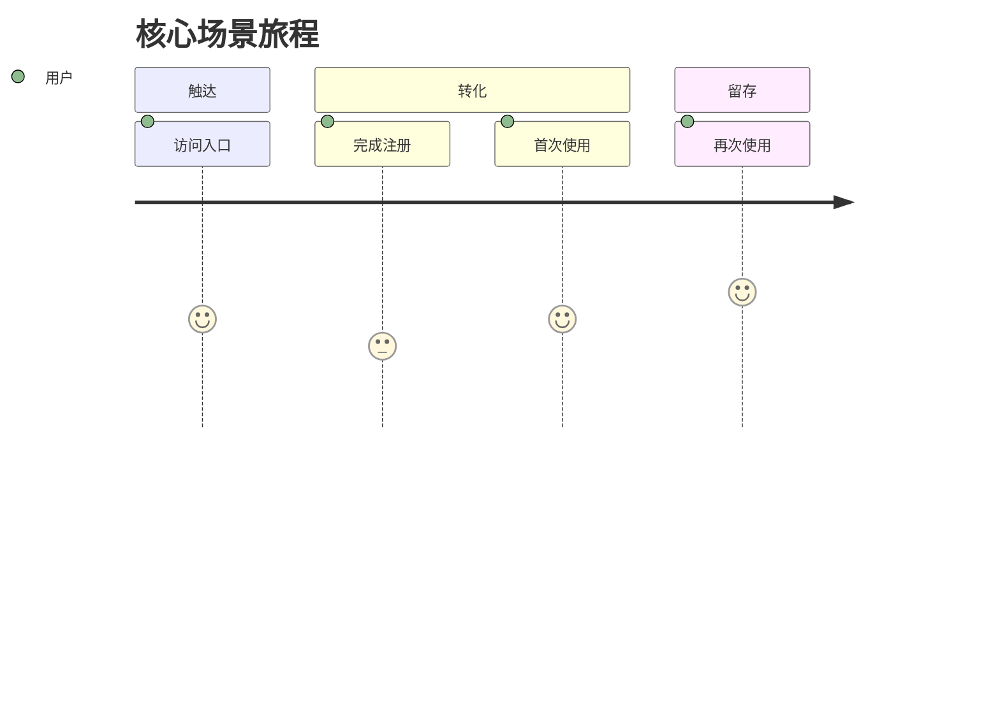
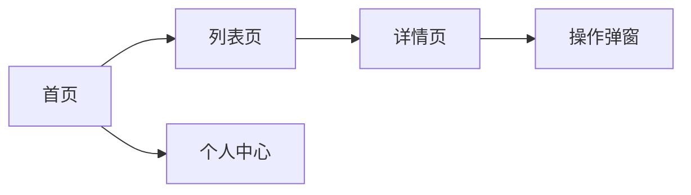
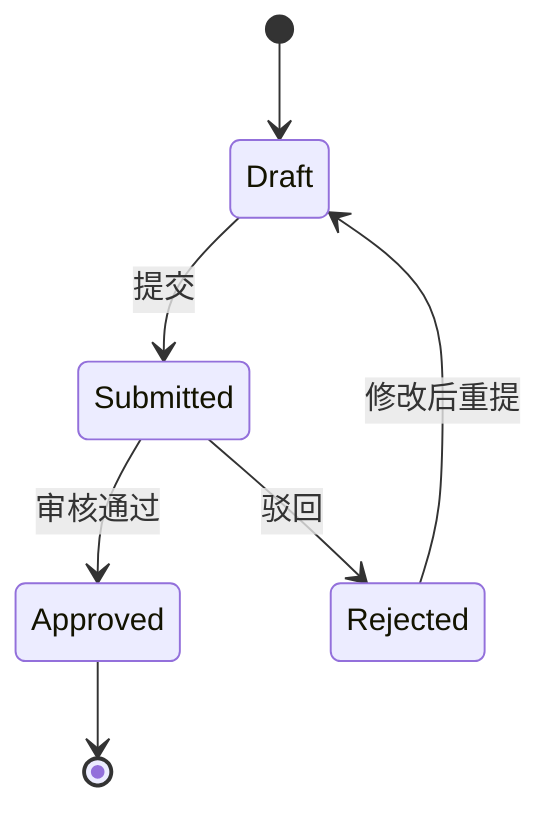

# 产品需求文档（PRD）

> 文档版本：v0.1  
> 最后更新：YYYY-MM-DD  
> 作者：<产品经理>  
> 评审人：<研发负责人 / 设计 / 测试 / 业务方>  
> 状态：Draft / Review / Approved / Released

---

## 0. 修订记录

| 版本 | 日期 | 变更摘要 | 作者 |
| ---- | ---- | -------- | ---- |
| v0.1 | YYYY-MM-DD | 初稿 | …… |

---

## 1. 概述

### 1.1 项目/需求名称
<一句话名称>

### 1.2 背景与问题
- **现状**：用户/业务当前是怎么做的。
- **痛点**：存在什么具体问题（带数据：转化率、耗时、成本…）。
- **机会**：为什么现在做、不做的代价。

### 1.3 目标与非目标
- **目标（In Scope）**
  - G1：……
  - G2：……
- **非目标（Out of Scope）**
  - 明确本期不做、避免范围蔓延。

### 1.4 成功指标（North Star & KPI）
| 指标 | 当前值 | 目标值 | 度量方式 | 上线后评估时间 |
| ---- | ------ | ------ | -------- | -------------- |
| 北极星指标 | …… | …… | …… | T+30 天 |
| 业务指标 1 | …… | …… | …… | T+14 天 |
| 体验指标 1 | …… | …… | …… | T+14 天 |

---

## 2. 用户与场景

### 2.1 目标用户
| 角色 | 描述 | 关键诉求 |
| ---- | ---- | -------- |
| 角色 A | …… | …… |
| 角色 B | …… | …… |

### 2.2 核心场景（User Story）
- **US-1**：作为 <角色>，我希望 <动作>，以便 <价值>。
- **US-2**：……

### 2.3 用户旅程

---

## 3. 需求范围

### 3.1 功能列表（MoSCoW）
| 编号 | 功能 | 优先级 | 关联用户故事 | 备注 |
| ---- | ---- | ------ | ------------ | ---- |
| F-001 | …… | Must   | US-1 | MVP |
| F-002 | …… | Should | US-2 | |
| F-003 | …… | Could  | US-3 | |
| F-004 | …… | Won't  | -    | 下期评估 |

### 3.2 功能详述（逐条展开）

#### F-001 <功能名>
- **描述**：做什么、解决谁的什么问题。
- **触发入口**：<页面 / 按钮 / 接口 / 事件>。
- **前置条件**：<登录态 / 权限 / 数据状态>。
- **主流程**：
  1. 用户……
  2. 系统校验……
  3. 系统返回……
- **分支/异常流**：
  - E1：参数非法 → 提示「……」。
  - E2：余额不足 → 跳转「……」。
- **业务规则**：
  - R1：……
  - R2：……
- **输入输出**：字段、类型、约束、示例。
- **验收标准（AC）**：
  - [ ] AC-1：Given …… When …… Then ……
  - [ ] AC-2：……

> 其余功能按相同结构展开。

---

## 4. 交互与视觉

### 4.1 信息架构 / 页面地图

### 4.2 关键页面清单
| 页面 | 入口 | 主要元素 | 设计稿 |
| ---- | ---- | -------- | ------ |
| 列表页 | 首页 → "全部" | 搜索、筛选、卡片列表、分页 | <Figma 链接> |
| 详情页 | 列表卡片 | 概要、操作区、相关推荐 | <Figma 链接> |

### 4.3 文案与本地化
- 文案规范：<风格 / 语气 / 大小写>
- 多语言：<是 / 否>，覆盖：<zh-CN / en-US / ……>

### 4.4 无障碍与适配
- WCAG 2.1 AA；键盘可达、对比度达标。
- 适配：桌面 ≥ 1280、移动端 ≥ 360。

---

## 5. 业务规则与数据

### 5.1 关键业务规则
- BR-1：……
- BR-2：……

### 5.2 状态机（如适用）

### 5.3 数据需求
| 数据项 | 类型 | 必填 | 来源 | 说明 |
| ------ | ---- | ---- | ---- | ---- |
| …… | string | 是 | 用户输入 | 长度 ≤ 64 |
| …… | enum | 是 | 系统 | A/B/C |

### 5.4 埋点与数据上报
| 事件名 | 触发时机 | 关键属性 | 用途 |
| ------ | -------- | -------- | ---- |
| `page_view_xxx` | 进入页面 | userId, source | 漏斗 |
| `click_xxx`     | 点击按钮 | itemId | 转化 |

---

## 6. 非功能需求

| 类别 | 要求 |
| ---- | ---- |
| 性能 | 关键页 P95 ≤ 1s；接口 P99 ≤ 300ms |
| 可用性 | ≥ 99.9% |
| 兼容性 | 最近 2 个版本主流浏览器；iOS ≥ 14、Android ≥ 9 |
| 安全合规 | 鉴权、权限、敏感数据加密；GDPR / 等保 |
| 隐私 | 收集前告知与授权；可导出/删除 |
| 可观测 | 关键路径埋点、错误上报、SLO 看板 |

---

## 7. 依赖与影响

### 7.1 上下游依赖
| 类型 | 名称 | 说明 | 联系人 |
| ---- | ---- | ---- | ------ |
| 内部服务 | …… | 提供 …… 接口 | …… |
| 外部三方 | …… | 调用方式 / 配额 / SLA | …… |

### 7.2 影响范围
- 既有功能：……
- 数据迁移：……
- 历史版本兼容：……

---

## 8. 发布计划

### 8.1 里程碑
| 阶段 | 时间 | 交付物 | 负责人 |
| ---- | ---- | ------ | ------ |
| 需求评审 | YYYY-MM-DD | PRD 通过 | PM |
| 设计评审 | YYYY-MM-DD | 高保真设计 | Design |
| 技术方案 | YYYY-MM-DD | 技术评审通过 | Tech |
| 提测 | YYYY-MM-DD | 自测通过 | Dev |
| 灰度 | YYYY-MM-DD | 5% → 50% | Dev / OPS |
| 全量 | YYYY-MM-DD | 100% | OPS |

### 8.2 发布策略
- 灰度方案：<按用户 / 按地域 / 按比例>
- 回滚预案：<判定条件 / 操作步骤>
- Feature Flag：<开关 key / 默认值>

### 8.3 上线检查清单
- [ ] 功能验收（AC 全部通过）
- [ ] 性能与压测达标
- [ ] 监控告警就绪（SLO、关键埋点）
- [ ] 文档（用户/客服/Runbook）
- [ ] 数据回滚与备份方案
- [ ] 法务/合规/安全 sign-off

---

## 9. 风险与权衡

| 风险 | 概率 | 影响 | 应对 | Owner |
| ---- | ---- | ---- | ---- | ----- |
| 三方接口不稳定 | 中 | 高 | 缓存 + 降级 | …… |
| 数据迁移失败 | 低 | 高 | 双写 + 灰度回滚 | …… |
| 时间风险 | 中 | 中 | 范围裁剪 / 增援 | …… |

---

## 10. 待定与未决

| 编号 | 问题 | 影响 | 负责人 | 截止日期 |
| ---- | ---- | ---- | ------ | -------- |
| OQ-1 | …… | …… | …… | YYYY-MM-DD |

---

## 11. 附录

### 11.1 术语表
| 术语 | 含义 |
| ---- | ---- |
| …… | …… |

### 11.2 参考资料
- 竞品分析：<link>
- 用户调研：<link>
- 数据分析：<link>
- 设计稿：<Figma 链接>
- 技术方案：[../system_architecture.md](../system_architecture.md)
