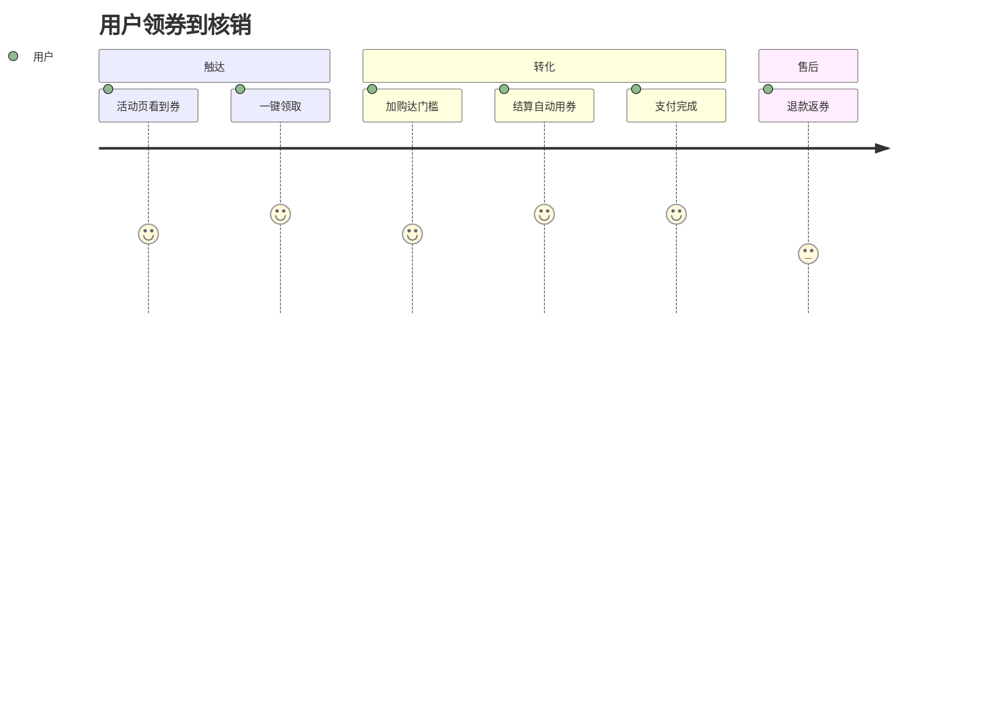
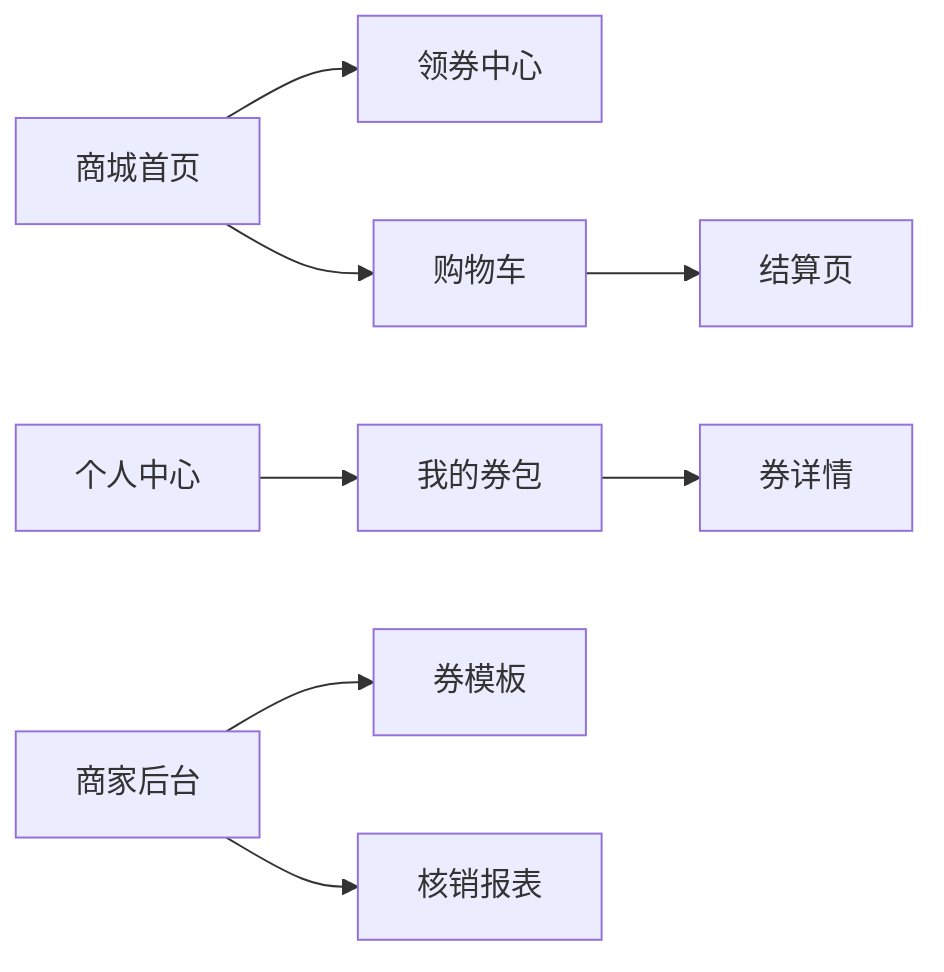
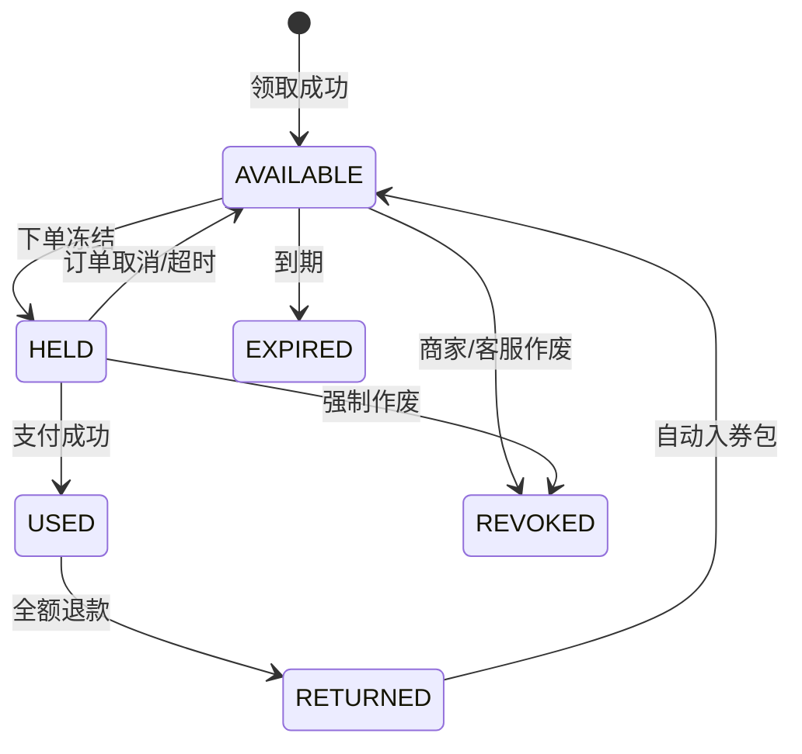

# PRD：Acme Shop 优惠券系统 v1

> 文档版本：v1.0  
> 最后更新：2026-04-29  
> 作者：李明（PM）  
> 评审人：王磊（研发）/ 周婷（设计）/ 陈颖（QA）/ 赵强（运营）  
> 状态：Approved  
> 关联：[../system_architecture_tpl.md](../system_architecture_tpl.md) · [../CLAUDE_tpl.md](../CLAUDE_tpl.md)

---

## 0. 修订记录

| 版本 | 日期 | 变更 | 作者 |
| ---- | ---- | ---- | ---- |
| v0.1 | 2026-04-08 | 初稿 | 李明 |
| v0.5 | 2026-04-15 | 补充叠加规则、风控策略 | 李明 |
| v1.0 | 2026-04-29 | 评审通过，进入开发 | 李明 |

---

## 1. 概述

### 1.1 名称
Acme Shop 优惠券系统 v1（满减券 + 折扣券）

### 1.2 背景与问题
- **现状**：商家仅能配置全店统一打折，无定向、无门槛控制。
- **痛点**：
  - 近 30 天活动转化率仅 1.8%，远低于行业均值 3.5%。
  - 客单价分布两极，缺少满减撬动加购。
  - 商家需求 Top1（季度调研 42%）：发券能力。
- **机会**：双 11 大促前（2026-11-11）上线，预计带来 GMV +8%。

### 1.3 目标 / 非目标
**目标（In Scope）**
- G1：商家可创建/管理满减券、折扣券，支持发放渠道与领取限制。
- G2：用户在购物车/结算页可查看可用券、自动选最优、手动切换。
- G3：完整核销链路（下单冻结、支付核销、退款返还）。
- G4：基础风控（同设备/同账号限领、黑名单）。

**非目标（Out of Scope）**
- 不做：免邮券、礼品卡、分享裂变、跨店通用券（v2 评估）。
- 不做：复杂叠加策略编辑器（v1 用固定规则）。

### 1.4 成功指标

| 指标 | 当前 | 目标 | 度量 | 评估时间 |
| ---- | ---- | ---- | ---- | -------- |
| 优惠券核销率 | - | ≥ 35% | 核销订单 / 领取数 | T+30 天 |
| 使用券订单客单价提升 | - | ≥ 15% | 对比未使用券订单 | T+30 天 |
| 大促首日 GMV | 基准 X | ≥ 1.08 X | 同比/环比 | 双 11 当天 |
| 领券页 P95 加载 | - | ≤ 800 ms | RUM 指标 | T+7 天 |
| 券系统接口可用性 | - | ≥ 99.95% | Prometheus | 月度 |

---

## 2. 用户与场景

### 2.1 角色

| 角色 | 描述 | 关键诉求 |
| ---- | ---- | -------- |
| C 端用户 | 注册买家 | 一眼看到能省多少、自动用最优 |
| 商家运营 | Acme Shop 商户 | 灵活配置、看清核销效果 |
| 平台运营 | Acme 内部 | 全局风控、活动审核 |
| 客服 | 商家客服 | 查询/补发/作废用户券 |

### 2.2 核心 User Story

- **US-1**：作为商家，我希望创建一张"满 200 减 30"的券并选择发放渠道，以便在大促拉动客单价。
- **US-2**：作为用户，我希望结算时自动用上最划算的券，以便不用手动比较。
- **US-3**：作为用户，我希望看到为什么某张券不可用（如未达门槛），以便补单或换券。
- **US-4**：作为客服，我希望按订单号定位券状态并可作废重发，以便处理投诉。

### 2.3 用户旅程

---

## 3. 需求范围

### 3.1 功能列表（MoSCoW）

| 编号 | 功能 | 优先级 | US | 备注 |
| ---- | ---- | ------ | -- | ---- |
| F-001 | 商家创建/编辑/下架券模板 | Must | US-1 | 含审核流 |
| F-002 | 券发放：定向/公开领取/订单返券 | Must | US-1 | |
| F-003 | 用户领券、券包查看 | Must | US-2 | |
| F-004 | 购物车/结算页选券 + 自动选最优 | Must | US-2,3 | |
| F-005 | 下单冻结、支付核销、退款返还 | Must | US-2 | |
| F-006 | 商家核销报表 | Should | US-1 | 日维度 |
| F-007 | 风控：限领、黑名单、设备指纹 | Should | - | 与风控组对接 |
| F-008 | 客服后台券查询/作废/补发 | Should | US-4 | |
| F-009 | 多券叠加策略编辑器 | Won't | - | v2 |
| F-010 | 分享裂变发券 | Won't | - | v2 |

### 3.2 功能详述

#### F-001 商家创建券模板
- **入口**：商家后台 → 营销 → 优惠券 → 新建。
- **前置**：商户已认证、未达活跃券模板上限（默认 50）。
- **主流程**：
  1. 选择类型：满减 / 折扣。
  2. 填写规则：门槛金额、优惠金额或折扣率（0.5–0.95，步进 0.05）、有效期（绝对时间或领取后 N 天）。
  3. 适用范围：全店 / 指定分类 / 指定 SKU 列表（≤ 500 个）。
  4. 发放设置：总量上限、单用户限领、领取渠道（公开领取页 / 定向 / 订单返券）。
  5. 提交 → 审核（满减 ≥ 200 元自动审核，折扣率 ≤ 0.7 走人工）→ 发布。
- **业务规则**：
  - R1：折扣券封顶可设（默认无）。
  - R2：同模板编辑后只对未发放部分生效，已发放券保留旧规则。
  - R3：下架后已发放未使用的券保留可用，不再新增发放。
- **异常**：
  - E1：门槛 ≤ 优惠金额 → 阻断并提示「优惠金额需小于门槛」。
  - E2：SKU 超 500 → 阻断并提示导入分批。
- **AC**：
  - [ ] AC-1：合法参数提交后 1s 内返回模板 ID。
  - [ ] AC-2：折扣率 0.6 的模板提交后状态为「待审核」。
  - [ ] AC-3：下架后用户已领取的券仍可在有效期内核销。

#### F-004 结算页选券与自动选最优
- **入口**：购物车 → 结算页加载完成。
- **主流程**：
  1. 服务端按当前购物车计算可用券集合。
  2. 默认选择"最大优惠"券；用户可手动切换或不使用。
  3. 切换后实时重算总价（防抖 300ms，乐观更新）。
  4. 若某券因价格变动失效（例如删除了部分商品），实时下线并提示。
- **业务规则**：
  - R1：v1 单订单最多使用 1 张券（与店铺活动可叠加，不与其他券叠加）。
  - R2：满减券作用于"商品总价"，不作用于运费。
  - R3：折扣券作用于券适用范围内的商品总价，按比例分摊到行项目（用于退款返还）。
  - R4：金额计算保留两位小数，向下取整后展示，差值由商家承担。
- **异常**：
  - E1：无可用券 → 显示「暂无可用券」与跳转去领券。
  - E2：所选券在提交订单瞬间过期 → 后端校验失败，前端弹窗"换券或继续不使用"。
- **AC**：
  - [ ] AC-1：购物车 3 件商品命中满减门槛时默认勾选优惠最大券。
  - [ ] AC-2：手动切换后总价与服务端计算一致（误差为 0）。
  - [ ] AC-3：删除商品后跌破门槛，券立即灰化并给出原因「需再购 ¥X」。

#### F-005 核销与退款返还
- **下单**：调用 `POST /orders` 时携带 `couponId`，服务端冻结券（`HELD`），写入订单。
- **支付**：支付成功 webhook 标记券 `USED`，记录 `usedAt/orderId`。
- **取消/超时**：30 分钟未支付，券解冻 `HELD → AVAILABLE`，恢复用户配额。
- **退款**：
  - 全额退款：券变 `RETURNED`，重新发到用户券包（剩余有效期 < 24h 时延长至 24h）。
  - 部分退款：券不返还（v1 简化），按券分摊金额从退款额扣减并展示明细。
- **AC**：
  - [ ] 30 分钟超时未支付，券自动恢复（误差 ≤ 60s）。
  - [ ] 全额退款 5s 内券回到用户券包。
  - [ ] 部分退款金额计算与展示符合 R3 分摊规则，单位测试覆盖三组以上典型场景。

> 其余功能（F-002/003/006/007/008）按上述结构展开，略。

---

## 4. 交互与视觉

### 4.1 信息架构

### 4.2 关键页面

| 页面 | 入口 | 主要元素 | 设计稿 |
| ---- | ---- | -------- | ------ |
| 领券中心 | 顶部导航 / Banner | 券卡片、领取按钮、剩余库存进度 | https://figma.com/file/xxx?node=12 |
| 我的券包 | 个人中心 | Tab：可用/已用/过期；券卡 | https://figma.com/file/xxx?node=34 |
| 结算页券抽屉 | 结算页"使用优惠券" | 可用列表 + 不可用列表（带原因） | https://figma.com/file/xxx?node=56 |
| 商家创建券 | 商家后台 → 营销 | 表单分步、预览卡片 | https://figma.com/file/xxx?node=78 |

### 4.3 文案
- 用户面：简体中文，简短动词开头（"立即领取""去使用"）。
- 不可用原因示例：`再购 ¥{X} 可用` / `不在活动商品范围` / `已超出限领次数`。

### 4.4 无障碍 / 适配
- WCAG 2.1 AA：券卡焦点可见、对比度 ≥ 4.5:1。
- 适配：移动端 360–430、桌面端 1280+；结算页券抽屉移动端为底部 sheet。

---

## 5. 业务规则与数据

### 5.1 关键规则
- BR-1：单用户单模板默认限领 1 张，可由商家配置 1–10。
- BR-2：同设备 24h 内同模板限领 3 张（风控硬上限）。
- BR-3：券面值不超过订单可优惠金额（满减 ≤ 商品总价）。
- BR-4：v1 不与其他券叠加，可与店铺活动（直降）叠加。

### 5.2 券状态机

### 5.3 数据需求（核心字段）

| 实体 | 字段 | 类型 | 必填 | 说明 |
| ---- | ---- | ---- | ---- | ---- |
| coupon_template | id, merchant_id, type(满减/折扣), threshold, value, scope, total, per_user_limit, valid_from, valid_to, status | - | 是 | 索引：merchant_id, status |
| coupon | id, template_id, user_id, code, status, held_order_id, used_order_id, expires_at | - | 是 | 唯一索引：(template_id, user_id) 用于限领判定 |
| coupon_redemption_log | id, coupon_id, action, order_id, amount, created_at | - | 是 | 审计 |

### 5.4 埋点

| 事件 | 触发 | 关键属性 | 用途 |
| ---- | ---- | -------- | ---- |
| `coupon_view` | 进入领券中心 | userId, templateIds | 曝光 |
| `coupon_claim` | 点击领取 | templateId, success, reason | 领取漏斗 |
| `coupon_select` | 结算页切换券 | orderId, couponId, autoSelected | 选择行为 |
| `coupon_redeem` | 支付核销 | couponId, orderId, discount | 核销率 |

---

## 6. 非功能需求

| 类别 | 要求 |
| ---- | ---- |
| 性能 | 领券中心 P95 ≤ 800ms；结算页券计算 P95 ≤ 200ms；下单核销 P99 ≤ 300ms |
| 可用性 | 99.95%；券服务故障时结算页降级为"暂不可用券"，不阻断下单 |
| 容量 | 双 11 峰值：领券 5k QPS、核销 800 RPS |
| 安全 | 防刷（限频 + 设备指纹 + 验证码）、防越权（券归属校验）、防并发超发（库存原子扣减） |
| 一致性 | 券状态最终一致 ≤ 5s；下单与冻结同事务 |
| 可观测 | 全链路 traceId；券状态变更全量审计；Grafana 看板：领取率、核销率、失败原因 Top |
| 合规 | 用户券包导出/删除（GDPR）；商家活动审核留痕 |

---

## 7. 依赖与影响

### 7.1 上下游

| 类型 | 名称 | 说明 | 联系人 |
| ---- | ---- | ---- | ------ |
| 内部 | orders 服务 | 提供下单/支付 webhook、退款事件 | 王磊 |
| 内部 | catalog 服务 | 提供 SKU/分类校验 | 刘洋 |
| 内部 | risk 服务 | 设备指纹、黑名单查询 | 孙浩 |
| 外部 | Stripe | 支付回调（已有） | - |

### 7.2 影响范围
- 结算页改造：新增券抽屉与价格重算（前端 + BFF）。
- 订单表新增 `coupon_id`、`discount_amount`、`coupon_snapshot` 字段。
- 现有"全店打折"活动保留，与券可叠加（按 BR-4）。
- 数据迁移：无（新模块）。

---

## 8. 发布计划

### 8.1 里程碑

| 阶段 | 时间 | 交付 | 负责人 |
| ---- | ---- | ---- | ------ |
| 需求评审 | 2026-04-29 | PRD v1.0 | 李明 |
| 技术评审 | 2026-05-06 | 设计文档 + 接口契约 | 王磊 |
| 设计终稿 | 2026-05-13 | Figma 高保真 | 周婷 |
| 提测 | 2026-06-17 | 自测通过 | 王磊 |
| QA & 压测 | 2026-06-24 | 测试报告 + 压测达标 | 陈颖 |
| 灰度（5%） | 2026-07-01 | 监控正常 24h | 运维 |
| 全量 | 2026-07-08 | 100% | 运维 |
| 大促演练 | 2026-10-20 | 全链路压测 5k QPS | 全员 |

### 8.2 发布策略
- 灰度：按 userId hash 5% → 25% → 100%；商家后台分批白名单。
- Feature Flag：`feature.coupon.v1`（默认 off），由 LaunchDarkly 控制。
- 回滚：关闭 flag → 隐藏入口；已发放券保留可用；DB schema 向前兼容。

### 8.3 上线 Checklist
- [ ] 全部 AC 通过、E2E 用例覆盖核销主链路
- [ ] 5k QPS 压测达标，DB 慢查询 = 0
- [ ] 监控/告警就绪：核销失败率、库存超发、退款返券异常
- [ ] 客服后台与 Runbook 上线
- [ ] 法务确认券有效期 / 退款条款文案
- [ ] 安全 review：限频、越权、设备指纹

---

## 9. 风险与权衡

| 风险 | 概率 | 影响 | 应对 | Owner |
| ---- | ---- | ---- | ---- | ----- |
| 大促瞬时领券超发 | 中 | 高 | Redis Lua 原子扣减 + DB 兜底唯一索引 | 王磊 |
| 折扣分摊浮点误差 | 中 | 中 | 整型分计算，单测覆盖；差值商家承担 | 王磊 |
| 风控误伤正常用户 | 中 | 中 | 软提示 + 申诉通道；阈值灰度调参 | 孙浩 |
| 退款返券与财务对账不齐 | 低 | 高 | 核销日志全量 + 每日对账任务 | 王磊 |
| 时间风险：双 11 前完成 | 中 | 高 | 砍 F-006 报表的趋势图；保住主链路 | 李明 |

---

## 10. 待定问题

| 编号 | 问题 | 影响 | Owner | 截止 |
| ---- | ---- | ---- | ----- | ---- |
| OQ-1 | 部分退款是否按比例返券（v1 不返）需财务确认 | 用户体验 | 李明 | 2026-05-10 |
| OQ-2 | 折扣率审核阈值是否动态可配 | 运营效率 | 赵强 | 2026-05-06 |
| OQ-3 | 是否需要"过期前 24h"推送提醒 | 核销率 | 李明 | 2026-05-20 |

---

## 11. 附录

### 11.1 术语
| 术语 | 含义 |
| ---- | ---- |
| 满减券 | 满 X 减 Y 的优惠券 |
| 折扣券 | 整单或范围内按比例折扣 |
| 冻结（HELD） | 下单时占用，支付/取消后转为终态 |
| 返券 | 全额退款后券回到用户券包 |

### 11.2 参考
- 竞品：拼多多/Shopify Coupon 模块对比备忘 `docs/research/coupon-competitor.md`
- 用户调研：2026 Q1 商家访谈纪要
- 数据：BI 看板 https://bi.acme.com/d/coupon-baseline
- 设计稿：https://figma.com/file/xxx
- 技术方案：[../system_architecture_tpl.md](../system_architecture_tpl.md)
