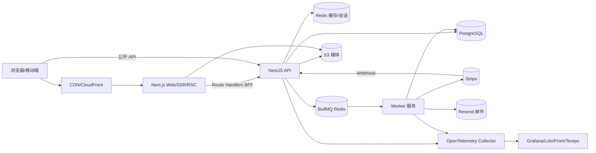
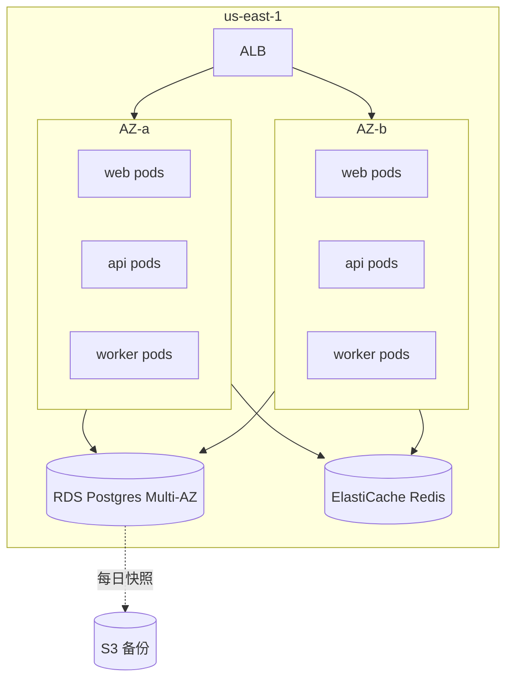
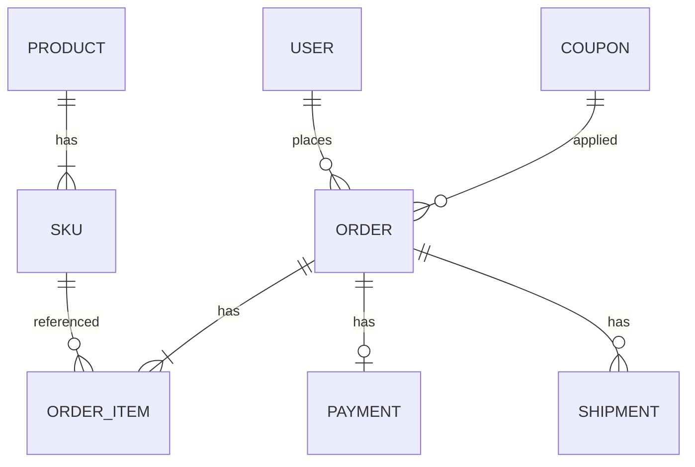

# Acme Shop 系统架构设计文档

> 文档版本：v1.3  
> 最后更新：2026-04-29  
> 作者：平台架构组  
> 状态：Approved

---

## 1. 文档概述

### 1.1 目的
描述 Acme Shop（轻量电商平台）的整体架构、关键决策与运行机制，作为研发、测试、运维、安全的统一参考。

### 1.2 适用范围
覆盖 v1.x 阶段的 Web 端、商家后台、API 服务、异步任务、数据存储与基础设施。不覆盖：BI 数据集市、移动端 App。

### 1.3 术语
| 术语 | 含义 |
| ---- | ---- |
| BFF  | Backend For Frontend，Next.js Route Handlers |
| SSR/RSC | Server Side Rendering / React Server Components |
| Idempotency-Key | 客户端幂等键，用于支付/下单重试 |

### 1.4 参考
- PRD：`docs/prd/v1.3.md`
- API：Swagger UI `/api/docs`
- 数据字典：`packages/db/prisma/schema.prisma`

---

## 2. 业务背景与目标

### 2.1 背景
中小商家缺少轻量、可自托管的电商方案，市面 SaaS 抽成高且定制能力差。

### 2.2 目标
- 提供"开箱即用"的商品-下单-支付-履约闭环。
- 商家可在 1 小时内完成入驻与首单。
- 支持单实例 1k DAU 顺畅运行，可水平扩展至 10w DAU。

### 2.3 SLO
| 指标 | 目标 |
| ---- | ---- |
| 接口可用性 | ≥ 99.9% |
| 下单 P99 延迟 | ≤ 400 ms |
| 支付回调端到端 | ≤ 2 s |
| 错误预算 | 0.1% / 月 |

---

## 3. 需求与约束

### 3.1 功能（摘要）
商品/SKU、购物车、下单、支付（Stripe）、库存、订单、退款、商家后台、营销券。

### 3.2 非功能
| 类别 | 要求 |
| ---- | ---- |
| 性能 | 峰值 500 RPS，可水平扩展 |
| 可用性 | 99.9%，多 AZ 部署 |
| 安全 | OWASP Top 10、PCI-DSS（支付走 Stripe Hosted） |
| 合规 | GDPR：数据可导出/删除 |
| 可观测性 | 全链路 Trace + 结构化日志 + RED 指标 |

### 3.3 约束
- Node.js 单一技术栈（团队精通）。
- 初期单 region（us-east-1），预留多 region 演进空间。
- 支付不自建，使用 Stripe。

---

## 4. 设计原则

- **单体优先，模块清晰**：以 NestJS 模块化单体起步，必要时再拆服务。
- **类型贯穿全栈**：`packages/shared` 的 zod schema 同时驱动前端表单、API DTO、OpenAPI。
- **幂等优先**：所有写接口支持 `Idempotency-Key`。
- **同步快、异步稳**：HTTP 仅做编排，重活进 BullMQ。
- **可观测先行**：每条链路必须有 traceId，日志/指标/追踪三位一体。

---

## 5. 总体架构

### 5.1 全景图

### 5.2 分层
| 层 | 组件 | 职责 |
| -- | ---- | ---- |
| 接入 | CloudFront + ALB | TLS、缓存、WAF |
| 表现 | Next.js（web） | 页面、SEO、SSR、BFF |
| 应用 | NestJS（api、worker） | 业务编排、领域逻辑 |
| 领域 | `apps/api/src/domain/*` | 实体、用例、领域事件 |
| 数据 | Prisma + PostgreSQL + Redis + S3 | 持久化、缓存、媒体 |
| 平台 | EKS、Helm、ArgoCD、Otel | 部署、观测、CI/CD |

### 5.3 部署拓扑

---

## 6. 模块设计

### 6.1 模块清单
| 模块 | 职责 | 关键依赖 |
| ---- | ---- | -------- |
| `auth` | 注册、登录、会话、RBAC | NextAuth、JWT |
| `catalog` | 商品/SKU/分类/库存 | Postgres、S3 |
| `cart` | 购物车、价格计算 | Redis（持久化购物车）、catalog |
| `orders` | 订单生命周期、状态机 | catalog、payments、queue |
| `payments` | Stripe Checkout、Webhook、退款 | Stripe |
| `fulfillment` | 物流单、发货、轨迹 | 第三方物流 API |
| `marketing` | 优惠券、活动 | orders |
| `admin` | 商家后台 | 全部模块 |
| `notifications` | 邮件、站内信 | Resend、queue |

### 6.2 关键模块：Orders
- **状态机**：`CREATED → PAID → FULFILLING → SHIPPED → COMPLETED`，分支：`CANCELLED`、`REFUNDING`、`REFUNDED`。
- **核心接口**：
  - `POST /orders`（幂等）
  - `POST /orders/:id/pay`（生成 Stripe Session）
  - `POST /webhooks/stripe`（异步回调，签名校验）
  - `POST /orders/:id/refund`
- **一致性**：下单与库存扣减在同一 DB 事务；支付成功后通过 outbox + BullMQ 触发履约。
- **异常**：库存不足 → `409 INSUFFICIENT_STOCK`；支付超时 → 自动取消（30 分钟）。

---

## 7. 接口设计

### 7.1 规范
- 协议：HTTPS / JSON（公开），内部模块使用本地调用（单体）。
- 风格：REST + 资源路径；批操作走 `POST /resource:action`。
- 鉴权：用户 → NextAuth 会话 Cookie；服务间 → 短期 JWT。
- 版本：URL 前缀 `/api/v1`；破坏性变更升 v2 并保留 v1 至少 6 个月。
- 错误：统一 `{ code, message, details?, traceId }`，HTTP 状态码遵循 RFC 7807 风格。

### 7.2 关键接口
| 接口 | 方法 | 路径 | 说明 |
| ---- | ---- | ---- | ---- |
| 创建订单 | POST | `/api/v1/orders` | Header: `Idempotency-Key` |
| 查询订单 | GET  | `/api/v1/orders/:id` | 仅本人或管理员 |
| 发起支付 | POST | `/api/v1/orders/:id/pay` | 返回 Stripe URL |
| 退款 | POST | `/api/v1/orders/:id/refund` | 商家权限 |
| Stripe Webhook | POST | `/api/v1/webhooks/stripe` | 签名校验 |

### 7.3 异步与契约
- 队列：`order.paid`、`order.fulfill`、`notification.email`。
- 事件载荷：`packages/shared/events/*` 用 zod 定义，runtime 校验。
- Webhook：所有第三方回调记录原始报文 24 小时，支持手动重放。

---

## 8. 数据架构

### 8.1 ER（核心）

### 8.2 存储选型
| 数据 | 存储 | 理由 |
| ---- | ---- | ---- |
| 业务事务 | PostgreSQL（RDS Multi-AZ） | ACID、JSONB、成熟 |
| 缓存/购物车/会话/限流 | Redis（ElastiCache） | 低延迟 |
| 队列 | BullMQ on Redis | 与缓存共用，运维简单 |
| 媒体 | S3 + CloudFront | 静态分发 |
| 全文搜索 | Postgres `pg_trgm` + GIN（v1）；预留 Meilisearch（v2） | 控制复杂度 |

### 8.3 数据流
- **在线**：Web/Browser → API → Postgres/Redis。
- **事件**：DB outbox 表 → BullMQ → Worker → 第三方 / 通知。
- **离线**：每日 RDS 快照 + 逻辑导出至 S3，供后续数仓接入。

### 8.4 治理
- 分级：P0（支付/订单）、P1（用户）、P2（行为日志）。
- 备份：RDS 自动快照 7 天 + 每日逻辑备份 30 天；RPO ≤ 24h，RTO ≤ 1h。
- GDPR：用户可申请导出/删除，删除走软删 30 天后硬删。

---

## 9. 关键技术选型

| 维度 | 选型 | 备选 | 理由 |
| ---- | ---- | ---- | ---- |
| 全栈语言 | TypeScript | Go/Python | 前后端共享类型，团队精通 |
| 前端框架 | Next.js 14 | Remix | RSC + 生态 + Vercel 兼容 |
| 后端框架 | NestJS | Express、Fastify 裸用 | 模块化、DI、可测试 |
| ORM | Prisma | TypeORM、Drizzle | 类型安全、迁移成熟 |
| 队列 | BullMQ | SQS、Kafka | 与 Redis 复用、运维简单 |
| 支付 | Stripe | Adyen | 文档好、合规成本低 |
| 部署 | EKS + Helm | ECS、Vercel | 统一编排、可控 |

---

## 10. 安全架构

- **认证**：NextAuth（GitHub/邮箱魔链），会话 JWT 签名 + HttpOnly Cookie。
- **授权**：CASL（前后端共享 ability 定义），按 `user/merchant/admin` 三角色。
- **传输**：全链路 TLS 1.3；内部 mTLS 由 service mesh（Istio）兜底。
- **数据**：Postgres TDE；PII 字段使用 `pgcrypto` 列加密；密钥在 AWS KMS。
- **应用**：`helmet`、CSP、CSRF（双 cookie 模式）、`zod` 输入校验。
- **支付**：不接触卡号，全部走 Stripe Checkout（PCI-DSS SAQ A）。
- **审计**：管理员操作写入 `audit_log` 表，附 traceId 与原始请求摘要。
- **依赖**：Dependabot + `pnpm audit` + Snyk；高危 24 小时内修复。

---

## 11. 高可用与容灾

| 维度 | 策略 |
| ---- | ---- |
| 无状态服务 | web/api/worker ≥ 2 副本，HPA 基于 CPU 与 RPS |
| 数据库 | RDS Multi-AZ + 自动故障切换；只读副本用于报表 |
| Redis | ElastiCache 主从 + 自动 failover |
| 流量治理 | Nest 全局限流（IP + 用户）、断路器（opossum）、超时统一 3s |
| 发布 | ArgoCD 滚动 + Canary（5% → 50% → 100%） |
| 灾备 | 跨 region S3 复制；DB 每日逻辑备份至备 region |
| 演练 | 每季度断电演练（kill api/redis/db），目标 RTO ≤ 1h |

---

## 12. 性能与容量

- **基线**：当前 200 RPS，DB 50 conn；目标半年内承载 500 RPS。
- **优化路径**：
  - 商品详情：RSC + CDN（stale-while-revalidate）。
  - 列表查询：Redis 缓存 + 游标分页（避免 OFFSET）。
  - 写路径：Prisma `interactiveTransaction` + 索引（`order(user_id, created_at desc)`）。
  - 重活异步化：发邮件、生成发票、出库通知全部走 BullMQ。
- **压测**：k6 周度跑下单链路 500 RPS × 10 分钟，纳入 CI 夜间任务。

---

## 13. 可观测性

- **日志**：pino JSON 输出 → Promtail → Loki；统一字段 `traceId/userId/orderId`。
- **指标**：Prometheus；NestJS interceptor 暴露 `http_request_duration_seconds`、`bull_job_*`。
- **追踪**：OpenTelemetry SDK，自动注入 fetch/Prisma/BullMQ；导出至 Tempo。
- **告警**：Alertmanager → PagerDuty；P0：5xx > 1% 持续 5 分钟、支付 webhook 失败率 > 2%。
- **SLO 看板**：Grafana 内置每模块 RED 看板。

---

## 14. DevOps 与交付

- **代码**：GitHub，单仓 monorepo，主干 `main` 受保护。
- **CI**：GitHub Actions —— `lint → typecheck → test → build → docker → trivy scan`。
- **CD**：ArgoCD 监听 `infra/k8s` 目录；镜像走 Canary 发布。
- **环境**：`dev`（本地 docker-compose）、`staging`（共享集群）、`prod`（独立集群）。
- **配置**：Doppler 注入到 K8s Secret；非敏感配置走 ConfigMap。
- **回滚**：ArgoCD 一键回滚到上一 sync revision；DB migration 仅前向，破坏性变更走"扩展-迁移-收缩"三步法。

---

## 15. 风险与权衡

| 风险 | 等级 | 影响 | 应对 |
| ---- | ---- | ---- | ---- |
| 单体拆分滞后 | 中 | 模块耦合增长 | 严守模块边界；季度评估拆服务 |
| Stripe 故障 | 中 | 支付不可用 | 缓存 Checkout URL；展示降级页 |
| Redis 单点 | 中 | 队列/缓存中断 | Multi-AZ + 队列幂等 + DB outbox 兜底 |
| Prisma 长事务 | 低 | DB 连接耗尽 | 事务 ≤ 2s，慢查询告警 |
| Node 单线程阻塞 | 低 | 延迟上升 | CPU 重活下沉到 worker，启用 cluster |

---

## 16. 演进路线

| 阶段 | 时间 | 目标 |
| ---- | ---- | ---- |
| v1.x | 2026 H1 | 单体 + 单 region，达到 99.9% SLO |
| v2.0 | 2026 H2 | 拆出 `payments`、`fulfillment` 独立服务；接入 Meilisearch |
| v2.x | 2027 H1 | 多 region 只读、移动端 BFF、商家开放平台 |

---

## 17. 附录

### 17.1 ADR 索引
| 编号 | 标题 | 状态 | 日期 |
| ---- | ---- | ---- | ---- |
| ADR-0001 | 选择 NestJS 模块化单体起步 | Accepted | 2025-11-10 |
| ADR-0002 | 用 Prisma 而非 Drizzle | Accepted | 2025-11-22 |
| ADR-0003 | 支付外包 Stripe，不自建 | Accepted | 2025-12-05 |
| ADR-0004 | BullMQ 复用 Redis 作为队列 | Accepted | 2026-01-12 |

### 17.2 变更记录
| 版本 | 日期 | 变更 | 作者 |
| ---- | ---- | ---- | ---- |
| v1.0 | 2025-12-01 | 初版 | 架构组 |
| v1.2 | 2026-02-20 | 增加 Otel 链路、Canary 发布 | 架构组 |
| v1.3 | 2026-04-29 | 增补容灾演练、GDPR 流程 | 架构组 |
