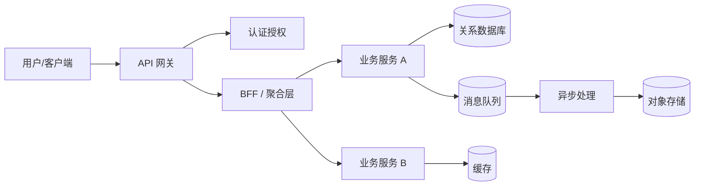
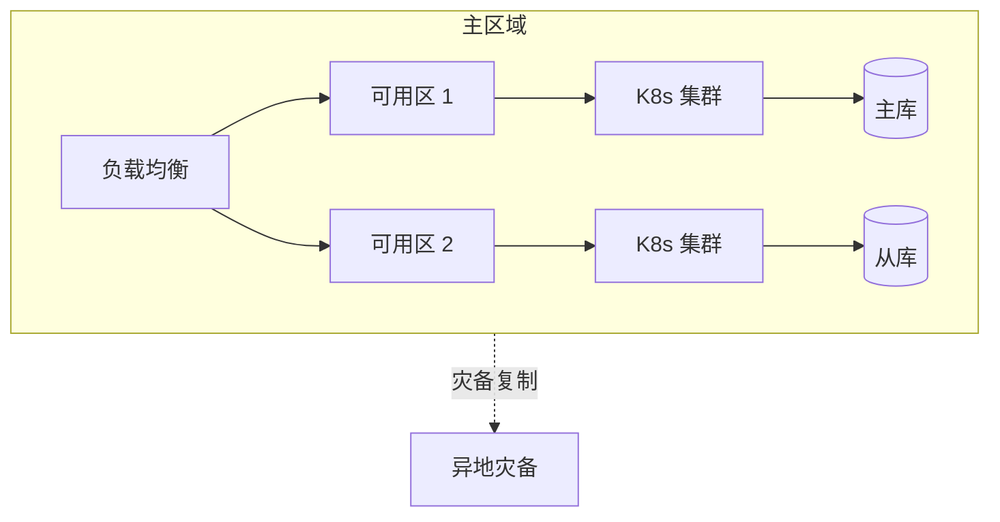
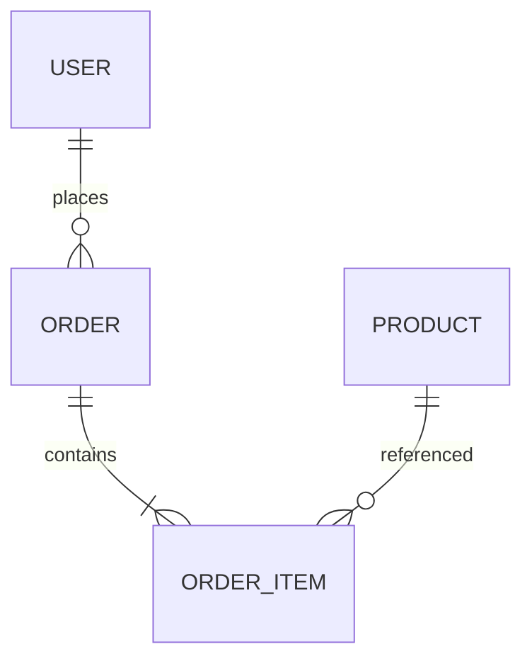

# 系统架构设计文档（System Architecture Document）

> 文档版本：v1.0  
> 最后更新：YYYY-MM-DD  
> 作者：<姓名 / 团队>  
> 状态：Draft / Review / Approved

---

## 1. 文档概述

### 1.1 目的
简要说明本文档的编写目的、面向读者（架构师、开发、测试、运维、产品等）以及预期价值。

### 1.2 适用范围
明确本架构文档涵盖的系统边界、版本范围以及不在范围内的内容。

### 1.3 术语与缩略语
| 术语 | 全称 | 说明 |
| ---- | ---- | ---- |
| API  | Application Programming Interface | 应用程序编程接口 |
| SLA  | Service Level Agreement | 服务等级协议 |

### 1.4 参考文档
- 《产品需求文档（PRD）》
- 《接口规范》
- 《数据字典》
- 相关行业标准 / RFC

---

## 2. 业务背景与目标

### 2.1 业务背景
描述项目所处的业务环境、痛点与机会。

### 2.2 业务目标
- 业务目标 1
- 业务目标 2

### 2.3 关键成功指标（KPI / SLO）
| 指标 | 目标值 | 度量方式 |
| ---- | ------ | -------- |
| 可用性 | ≥ 99.95% | 月度统计 |
| P99 延迟 | ≤ 200 ms | APM 监控 |
| 吞吐量 | ≥ 1000 QPS | 压测 + 线上监控 |

---

## 3. 需求与约束

### 3.1 功能性需求（摘要）
列出核心功能模块清单，详情参考 PRD。

### 3.2 非功能性需求
| 类别 | 要求 |
| ---- | ---- |
| 性能 | 支持峰值 QPS、P99 延迟 |
| 可用性 | 高可用部署、故障自动切换 |
| 可扩展性 | 水平扩展、模块解耦 |
| 安全性 | 认证、授权、加密、审计 |
| 可维护性 | 监控、日志、可观测性 |
| 合规性 | GDPR / 等保 / ISO 27001 |

### 3.3 假设与约束
- 技术栈约束：……
- 预算 / 人力约束：……
- 上下游依赖约束：……

---

## 4. 架构设计原则

- **简单性（KISS）**：优先选择简单可维护的方案。
- **单一职责**：模块边界清晰，职责单一。
- **松耦合 / 高内聚**：通过接口与事件解耦。
- **可演进性**：支持渐进式重构与替换。
- **可观测性优先**：日志、指标、追踪三位一体。
- **安全左移**：在设计阶段引入安全考量。
- **失败可控**：默认不可信，做好降级、熔断、限流。

---

## 5. 总体架构

### 5.1 架构全景图

### 5.2 分层说明
| 层级 | 职责 | 关键技术 |
| ---- | ---- | -------- |
| 接入层 | 流量入口、负载均衡、限流 | Nginx / API Gateway |
| 应用层 | 业务逻辑、流程编排 | Spring Boot / Go / Node.js |
| 领域层 | 领域模型、核心规则 | DDD |
| 数据层 | 持久化、缓存、检索 | MySQL / Redis / ES |
| 基础设施 | 部署、监控、CI/CD | K8s / Prometheus / GitLab CI |

### 5.3 部署拓扑

---

## 6. 模块设计

### 6.1 模块清单
| 模块 | 职责 | 上游依赖 | 下游依赖 | 负责人 |
| ---- | ---- | -------- | -------- | ------ |
| 模块 A | …… | …… | …… | …… |
| 模块 B | …… | …… | …… | …… |

### 6.2 关键模块详解（示例）
**模块 A：<模块名>**
- 职责：……
- 核心接口：……
- 关键算法 / 流程：……
- 异常处理：……
- 性能与容量：……

---

## 7. 接口设计

### 7.1 对外接口规范
- 协议：HTTP/HTTPS、gRPC、WebSocket
- 风格：RESTful / RPC / 事件驱动
- 鉴权：OAuth2 / JWT / API Key
- 版本策略：URI 版本 `/api/v1/...`

### 7.2 关键接口示例
| 接口 | 方法 | 路径 | 说明 |
| ---- | ---- | ---- | ---- |
| 创建订单 | POST | `/api/v1/orders` | 创建新订单 |
| 查询订单 | GET  | `/api/v1/orders/{id}` | 按 ID 查询 |

### 7.3 内部通信
- 同步：gRPC / HTTP
- 异步：Kafka / RabbitMQ
- 契约管理：OpenAPI / Protobuf + 版本兼容策略

---

## 8. 数据架构

### 8.1 数据模型（ER 概览）

### 8.2 存储选型
| 数据类型 | 存储 | 选型理由 |
| -------- | ---- | -------- |
| 强一致事务数据 | MySQL / PostgreSQL | ACID、成熟生态 |
| 高频读 / 会话 | Redis | 低延迟、丰富数据结构 |
| 全文检索 | Elasticsearch | 倒排索引、聚合分析 |
| 大文件 / 媒体 | OSS / S3 | 低成本、海量存储 |
| 分析 / 数仓 | ClickHouse / Hive | 列式、海量分析 |

### 8.3 数据流转
- 在线链路：API → 服务 → DB / Cache
- 离线链路：CDC / Binlog → Kafka → 数仓 → BI

### 8.4 数据治理
- 数据分级与脱敏
- 数据保留与归档策略
- 备份与恢复（RPO / RTO）

---

## 9. 关键技术选型

| 维度 | 选型 | 备选 | 选型理由 |
| ---- | ---- | ---- | -------- |
| 编程语言 | …… | …… | 团队熟悉度、生态、性能 |
| 框架 | …… | …… | …… |
| 数据库 | …… | …… | …… |
| 中间件 | …… | …… | …… |
| 部署 | K8s | 虚机 | 弹性、自愈 |

---

## 10. 安全架构

- **认证**：OAuth2 / OIDC / SSO
- **授权**：RBAC / ABAC，最小权限原则
- **传输安全**：TLS 1.2+，双向认证（必要时）
- **数据安全**：敏感数据加密（AES-GCM）、字段级脱敏、密钥管理（KMS）
- **应用安全**：OWASP Top 10 防护、依赖扫描（SCA）、SAST/DAST
- **审计**：关键操作全量审计日志，不可篡改存储
- **网络安全**：分区分域、零信任、WAF / DDoS 防护

---

## 11. 高可用与容灾

| 维度 | 策略 |
| ---- | ---- |
| 无状态服务 | 多副本 + 自动伸缩 |
| 有状态服务 | 主从 / 集群 / 共识协议 |
| 流量治理 | 限流、熔断、降级、重试（带退避） |
| 灰度发布 | 蓝绿 / 金丝雀 / 滚动 |
| 容灾 | 同城双活 + 异地灾备，RPO ≤ X 分钟，RTO ≤ Y 分钟 |
| 故障演练 | 定期混沌工程演练 |

---

## 12. 性能与容量规划

- 容量基线：当前 / 1 年 / 3 年预测
- 压测策略：基准压测、峰值压测、稳定性压测
- 性能优化路径：缓存、异步化、批处理、读写分离、分库分表
- 资源评估：CPU / 内存 / 存储 / 网络 / 连接数

---

## 13. 可观测性

- **日志**：结构化日志（JSON），统一采集到 ELK / Loki
- **指标**：Prometheus + Grafana，覆盖 RED / USE 方法论
- **追踪**：OpenTelemetry，全链路 TraceID 透传
- **告警**：分级告警（P0/P1/P2），值班与升级机制
- **SLO/SLI**：明确定义并持续度量

---

## 14. DevOps 与交付

- 代码管理：Git + Trunk Based / Git Flow
- 分支策略与 Code Review 规范
- CI/CD：自动化构建、测试、扫描、部署
- 环境：dev / test / staging / prod 隔离
- 配置管理：集中化配置中心，敏感信息走密钥管理
- 发布策略：金丝雀 / 蓝绿 / 滚动；具备一键回滚

---

## 15. 风险与权衡

| 风险 | 等级 | 影响 | 应对措施 |
| ---- | ---- | ---- | -------- |
| 单点依赖 | 高 | 服务不可用 | 多活 / 缓存兜底 |
| 数据一致性 | 中 | 业务异常 | 最终一致 + 对账 |
| 第三方限流 | 中 | 链路阻塞 | 本地缓存 + 降级 |

---

## 16. 演进路线（Roadmap）

| 阶段 | 时间 | 目标 | 关键里程碑 |
| ---- | ---- | ---- | ---------- |
| MVP  | …… | 核心链路打通 | 上线核心功能 |
| V1   | …… | 性能与稳定性 | SLA 达标 |
| V2   | …… | 平台化 / 多租户 | 对外开放 |

---

## 17. 附录

### 17.1 架构决策记录（ADR）索引
| 编号 | 标题 | 状态 | 日期 |
| ---- | ---- | ---- | ---- |
| ADR-0001 | 选择 PostgreSQL 作为主存储 | Accepted | YYYY-MM-DD |

### 17.2 变更记录
| 版本 | 日期 | 变更内容 | 作者 |
| ---- | ---- | -------- | ---- |
| v1.0 | YYYY-MM-DD | 初版发布 | …… |
